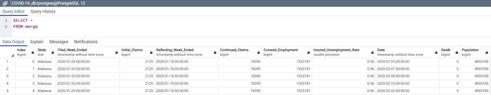

# ETL Project

## Data Sources

- [US Unemployment Weekly Claims Data](https://oui.doleta.gov/unemploy/claims.asp)
- [COVID-19: US Daily Death Counts Data](https://datahub.io/core/covid-19)

## Extraction of Data

- We downloaded CSV files from the above websites and pulled them into Jupyter Notebook.

## Transformation of Data

- We used Jupyter notebook for transformation of data, including filtering and aggregating.
- Unemployment Weekly Claims data is already grouped by state, so we didn't have to group any data.

  - Kept all the columns
  - Renamed the columns for easier reference
  - Converted the columns that contain dates: from string to date
  - Converted the columns that contain numbers: from stirng to float
  - Filtered date range: using the "Filed_Week_Ended" column to filter from 1/25/20 to 4/11/20

- US Daily Death Count data required multiple aspects of transformation to better align with the unemployment data that was measured by week. We also realized that this death count was cumulative, which changed our aggregating strategy. The following steps were performed:

  - We first reformatted the dates to match the format of the date variable in the unemployment file
  - We then filtered dates for weekly end points to match Unemployment Weekly Claims from 1/25/20 to 4/11/20 using "Filed Week Ended" variable in unemployment data.
  - We also cut down columns to variables that were more prevalent, including "Population", "Date", "Case", and "Province/State".
  - We changed "Case" to "Death" to better clarify the variable. We also changed "Province/State" to "State" to align with the Unemployment Weekly Claims data.
  - Lastly, we grouped by "State" and "Date", summing "Population" and "Death" columns.

- Lastly, we joined the tables by State and Date in jupyter notebook, creating a combined table. To establish a relationship between the tables, we created unique IDs for each table as columns in the merged table.

## Loaded Tables into Database

- We then loaded the two tables into Postgres SQL as our data was expressed in tables and therefore it is best to store in Postgres SQL. This required making a database in Postgres SQL and then loaded it from Jupyter Notebook.

- Below is the Entity Relationship Diagrams (ERD):

## We performed the following simple queries to review the data:

- Deaths vs Unemployment Claims: Order by unemployment claims as of 4/11/20\

- Deaths vs Unemployment Claims: Order by death counts as of 4/11/20\

- Here's screenshot of the merged table\

## Tips and Tricks

- Importance of understanding what your variables mean: We realized that US Death Count data was cumulative and collected by day, which required more in the transformation stage.

- Assessing ERD relationships when merging tables is helpful: ERD took some time to figure out the appropriate primary and foreign keys, but helped to better understand the data and merging of tables.

- Find appropriate tools to perform ETL: The vast majority of the operations done with SQL can be done more easily with Pandas when dealing with large datasets.
____________________________________

# Guidelines for ETL Project

This document contains guidelines, requirements, and suggestions for this Project.

## Team Effort

Due to the short timeline, teamwork will be crucial to the success of this project! Work closely with your team through all phases of the project to ensure that there are no surprises at the end of the week.

Working in a group enables you to tackle more difficult problems than you'd be able to working alone. In other words, working in a group allows you to **work smart** and **dream big**. Take advantage of it!

## Project Proposal

Before you start writing any code, remember that you only have one week to complete this project. View this project as a typical assignment from work. Imagine a bunch of data came in and you and your team are tasked with migrating it to a production data base.

Take advantage of your Instructor and TA support during office hours and class project work time. They are a valuable resource and can help you stay on track.

## Finding Data

Your project must use 2 or more sources of data. We recommend the following sites to use as sources of data:

- [data.world](https://data.world/)

- [Kaggle](https://www.kaggle.com/)

You can also use APIs or data scraped from the web. However, get approval from your instructor first. Again, there is only a week to complete this!

## Data Cleanup & Analysis

Once you have identified your datasets, perform ETL on the data. Make sure to plan and document the following:

- The sources of data that you will extract from.

- The type of transformation needed for this data (cleaning, joining, filtering, aggregating, etc).

- The type of final production database to load the data into (relational or non-relational).

- The final tables or collections that will be used in the production database.

You will be required to submit a final technical report with the above information and steps required to reproduce your ETL process.

## Project Report

At the end of the week, your team will submit a Final Report that describes the following:

- **E**xtract: your original data sources and how the data was formatted (CSV, JSON, pgAdmin 4, etc).

- **T**ransform: what data cleaning or transformation was required.

- **L**oad: the final database, tables/collections, and why this was chosen.

Please upload the report to Github and submit a link to Bootcampspot.
