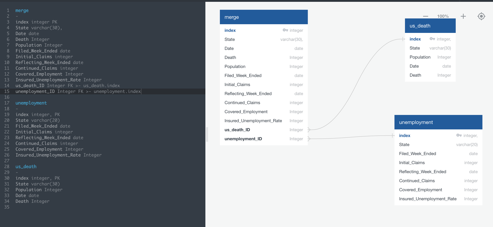
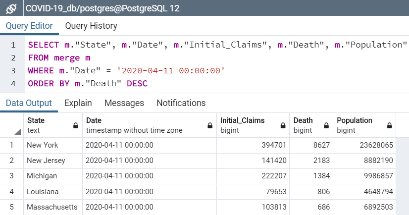

# ETL Project

## Data Sources

- [US Unemployment Weekly Claims Data](https://oui.doleta.gov/unemploy/claims.asp)
- [COVID-19: US Daily Death Counts Data](https://datahub.io/core/covid-19)

## Extraction of Data

- We downloaded CSV files from the above websites and pulled them into Jupyter Notebook.

## Transformation of Data

- We used Jupyter notebook for transformation of data, including filtering and aggregating.
- Unemployment Weekly Claims data is already grouped by state, so we didn't have to group any data.

  - Kept all the columns
  - Renamed the columns for easier reference
  - Converted the columns that contain dates: from string to date
  - Converted the columns that contain numbers: from stirng to float
  - Filtered date range: using the "Filed_Week_Ended" column to filter from 1/25/20 to 4/11/20

- US Daily Death Count data required multiple aspects of transformation to better align with the unemployment data that was measured by week. We also realized that this death count was cumulative, which changed our aggregating strategy. The following steps were performed:

  - We first reformatted the dates to match the format of the date variable in the unemployment file
  - We then filtered dates for weekly end points to match Unemployment Weekly Claims from 1/25/20 to 4/11/20 using "Filed Week Ended" variable in unemployment data.
  - We also cut down columns to variables that were more prevalent, including "Population", "Date", "Case", and "Province/State".
  - We changed "Case" to "Death" to better clarify the variable. We also changed "Province/State" to "State" to align with the Unemployment Weekly Claims data.
  - Lastly, we grouped by "State" and "Date", summing "Population" and "Death" columns.

- Lastly, we joined the tables by State and Date in jupyter notebook, creating a combined table. To establish a relationship between the tables, we created unique IDs for each table as columns in the merged table.

## Loaded Tables into Database

- We then loaded the two tables into Postgres SQL as our data was expressed in tables and therefore it is best to store in Postgres SQL. This required making a database in Postgres SQL and then loaded it from Jupyter Notebook.

- Below is the Entity Relationship Diagrams (ERD) and its sql code:\
  

- Below is the code to set up the schema

CREATE TABLE "merge" (\
 "index" integer NOT NULL,\
 "State" varchar(30), NOT NULL,\
 "Date" date NOT NULL,\
 "Death" Integer NOT NULL,\
 "Population" Integer NOT NULL,\
 "Filed_Week_Ended" date NOT NULL,\
 "Initial_Claims" integer NOT NULL,\
 "Reflecting_Week_Ended" date NOT NULL,\
 "Continued_Claims" integer NOT NULL,\
 "Covered_Employment" Integer NOT NULL,\
 "Insured_Unemployment_Rate" Integer NOT NULL,\
 "us_death_ID" Integer NOT NULL,\
 "unemployment_ID" Integer NOT NULL,\
 CONSTRAINT "pk_merge" PRIMARY KEY (\
 "index"\
 )\
);

CREATE TABLE "unemployment" (\
 "index" integer, NOT NULL,\
 "State" varchar(20) NOT NULL,\
 "Filed_Week_Ended" date NOT NULL,\
 "Initial_Claims" integer NOT NULL,\
 "Reflecting_Week_Ended" date NOT NULL,\
 "Continued_Claims" integer NOT NULL,\
 "Covered_Employment" Integer NOT NULL,\
 "Insured_Unemployment_Rate" Integer NOT NULL,\
 CONSTRAINT "pk_unemployment" PRIMARY KEY (\
 "index"\
 )\
);

CREATE TABLE "us_death" (\
 "index" integer, NOT NULL,\
 "State" varchar(30) NOT NULL,\
 "Population" Integer NOT NULL,\
 "Date" date NOT NULL,\
 "Death" Integer NOT NULL,\
 CONSTRAINT "pk_us_death" PRIMARY KEY (\
 "index"\
 )\
);

ALTER TABLE "merge" ADD CONSTRAINT "fk_merge_us_death_ID" FOREIGN KEY("us_death_ID")\
REFERENCES "us_death" ("index");

ALTER TABLE "merge" ADD CONSTRAINT "fk_merge_unemployment_ID" FOREIGN KEY\("unemployment_ID")\
REFERENCES "unemployment" ("index");

## We performed the following simple query to review the data:

- Deaths vs Unemployment Claims: Order by unemployment claims as of 4/11/20\
  

- Deaths vs Unemployment Claims: Order by death counts as of 4/11/20\
  

- Here's screenshot of the merged table\
  

- Below is the code to do simple queries to the database

SELECT \*\
FROM merge

SELECT u."State", u."Filed_Week_Ended", u."Initial_Claims", d."Date", d."Death"\
FROM unemployment u\
JOIN us_death d\
ON u."Filed_Week_Ended" = d."Date" AND u."State" = d."State"\
WHERE u."State" = 'Texas'

SELECT m."State", m."Date", m."Initial_Claims", m."Death", m."Population"\
FROM merge m\
WHERE m."Date" = '2020-04-11 00:00:00'\
ORDER BY m."Death" DESC

SELECT m."State", m."Date", m."Initial_Claims", m."Death", m."Population"\
FROM merge m\
WHERE m."Date" = '2020-04-11 00:00:00'\
ORDER BY m."Initial_Claims" DESC

## Tips and Tricks

- Importance of understanding what your variables mean: We realized that US Death Count data was cumulative and collected by day, which required more in the transformation stage.

- Assessing ERD relationships when merging tables is helpful: ERD took some time to figure out the appropriate primary and foreign keys, but helped to better understand the data and merging of tables.

- Find appropriate tools to perform ETL: The vast majority of the operations done with SQL can be done more easily with Pandas when dealing with large datasets.
